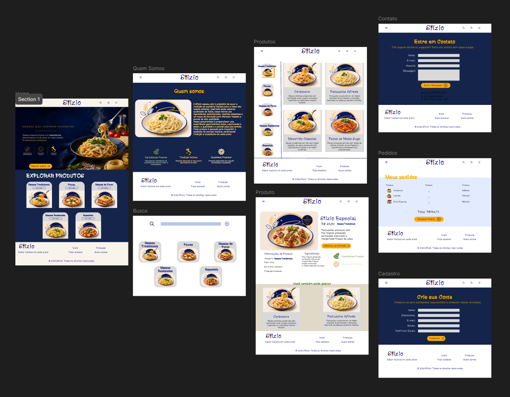

# Sfizio Massas

Site de e-commerce fictício desenvolvido como projeto escolar, com o objetivo de criar uma marca do zero — identidade visual, logotipo e site completo — usando HTML, CSS e Grid.

## Sobre o projeto

A Sfizio é uma marca fictícia de massas italianas, criada para simular um e-commerce completo. O projeto nasceu de uma atividade em duas etapas: primeiro o design da marca e do site no Figma (logotipo, identidade visual e wireframe), depois a construção do site em HTML e CSS a partir desse wireframe.

## Design no Figma

## Páginas

- **Home** (`index.html`) — página inicial com destaques e chamadas de marketing
- **Quem somos** (`quemsomos.html`)
- **Busca** (`busca.html`) — apresentação de resultados de busca de produtos
- **Produtos** (`produtos.html`) — grade de produtos organizada por categoria (Massas Tradicionais, Pizzas, Massas de Forno, Massas Recheadas, Especiais)
- **Produto** (`produto.html`) — detalhes de um produto selecionado
- **Contato** (`contato.html`) — formulário de contato
- **Pedidos** (`carrinho.html`) — pedidos do cliente, semelhante a um carrinho de compras
- **Cadastro** (`login.html`) — formulário de criação de conta

## Tecnologias e restrições da atividade

- HTML5 e CSS3, sem uso de `<table>`
- Layout majoritariamente construído com **CSS Grid**
- Identidade visual própria: logotipo, paleta de cores e tipografia customizada (`XperiencePasta.ttf`)

## Identidade visual

Logotipo, paleta de cores (mínimo de duas cores, sem cinza/preto/branco puro) e wireframe foram desenvolvidos no Figma antes da construção do site, seguindo a proposta da atividade.

## Como visualizar

Basta abrir o arquivo `index.html` em qualquer navegador ou clicar no seguinte link: [sfizio-massas](https://esteves-mth.github.io/sfizio-massas/)
